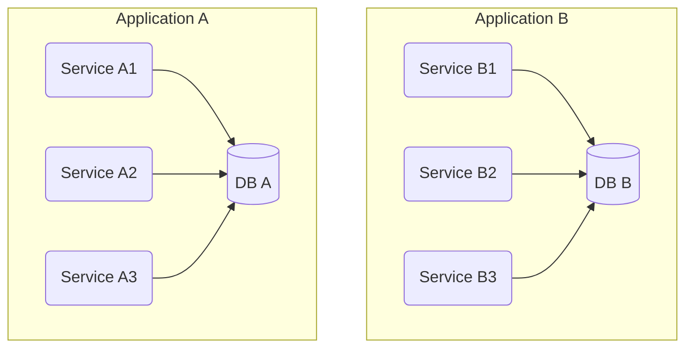
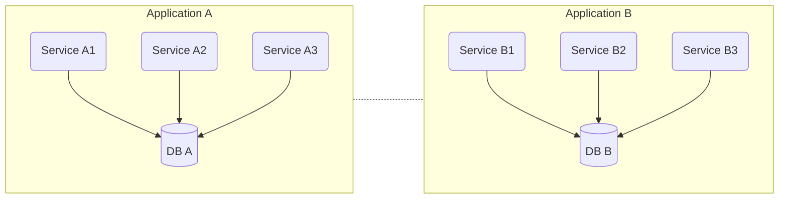
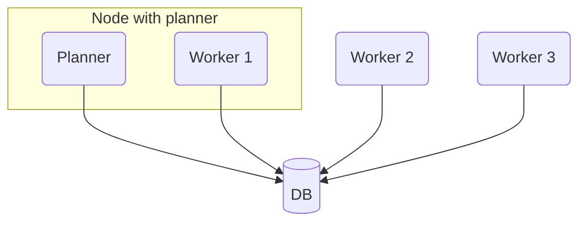
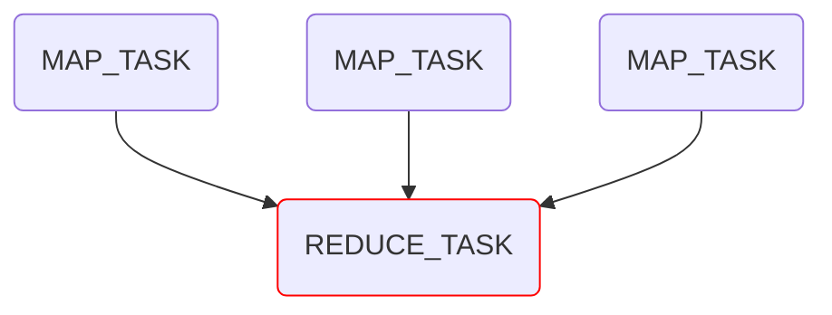
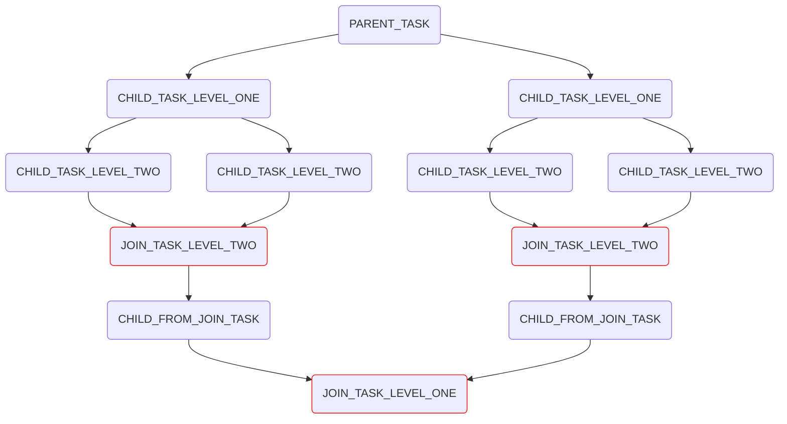

# distributed-task-framework
A lightweight task processor based on database only. Supports horizontal scaling, affinity protection and map-reduce.
<!-- TOC -->
* [distributed-task-framework](#distributed-task-framework)
  * [Introduction](#introduction)
    * [Architecture](#architecture)
    * [Goals](#goals)
    * [Features](#features)
  * [Install](#install)
    * [Spring Boot](#spring-boot)
  * [Quick start](#quick-start)
    * [Let's create a distributed task that will print message to console.](#lets-create-a-distributed-task-that-will-print-message-to-console)
    * [What happened](#what-happened)
  * [Concepts](#concepts)
    * [Workflow](#workflow)
    * [Task](#task)
    * [Remote task](#remote-task)
    * [Retry policy](#retry-policy)
      * [Fixed retry policy](#fixed-retry-policy)
      * [Backoff retry policy](#backoff-retry-policy)
      * [Disabled retry](#disabled-retry)
    * [Dead letter table](#dead-letter-table)
    * [Cron scheduled task](#cron-scheduled-task)
    * [Execution guarantee](#execution-guarantee)
      * [At-least-once](#at-least-once)
      * [Exactly-once](#exactly-once)
    * [Rate limiting](#rate-limiting)
    * [Timeout](#timeout)
    * [Affinity](#affinity)
    * [Join tasks](#join-tasks)
  * [Planner](#planner)
    * [Planner tuning](#planner-tuning)
      * [Node CPU limit](#node-cpu-limit)
      * [Polling frequency](#polling-frequency)
  * [Metrics](#metrics)
  * [Configuration properties](#configuration-properties)
  * [Problems](#problems)
  * [Solution](#solution)
  * [Samples](#samples)
  * [Perf test results](#perf-test-results)
  * [How it works?](#how-it-works)
  * [License](#license)
  * [Disclaimer](#disclaimer)
<!-- TOC -->
## Introduction
### Architecture
General work scheme:

Service A here is an instance of the application A. Please note that applications are fully independent and to call
task in service B from service A, you need to manually code this logic with RPC, message queue, etc. There are plans
to release [remote tasks](#remote-task) that is able to hide this cross-application communication from user.

Remote task concept:


Every instance of service is a worker, and one of instances is also have a planner. Scaling an application
gives more workers to cluster.

- **Planner** distributes tasks to workers according to their load.
- **Worker** picks planned tasks and executes them.

### Goals
- To build a task execution cluster that is based on JVM microservices. All you need is a DTF library and Spring starter to begin.
- To minimize infrastructure dependency. DTF avoids using message brokers or other services, except PostgreSQL.
    In standard architecture all service instances are connected to the same database. DTF keeps all tasks
    state in DB only, and all communications are made through DB. As a bonus, it allows to achieve an exactly-once
    execution guarantee (with some limitations).
- To provide a simple coding syntax.

For now, DTF allows only one service execution (one service, but multiple instances). We plan to add
support of cross-service task execution. Currently, developer has to create control endpoints (or using other 
communication mean) to start task execution in another service.

### Features
- At-least-once and exactly-once execution guarantees.
- Configurable retries: fixed or backoff strategies.
- Limit number of task executions per worker and per cluster.
- Prevent concurrent task execution that works with common resource: affinity and affinity group.
- Workflow support. Makes it possible to organize tasks in a groups.
- Map-Reduce tasks. Allows parallelizing computations and collect results on a last step. 
- Configurable with settings, or spring properties, or annotations.

## Install
### Spring Boot
Add starter to your project
```groovy
implementation 'com.distributed_task_framework:distributed-task-spring-boot-starter:<the most recent version>'
```
Add liquibase init script to your service:

```yaml
databaseChangeLog:
  - include:
      file: db/changelog/distributed-task-framework/db.changelog-dtf-init.yaml
```
If you use another DB migration framework, rely on the raw SQL scripts: [001_dtf_init.up.sql](distributed-task-library%2Fsrc%2Fmain%2Fresources%2Fdb%2Fchangelog%2Fdistributed-task-framework%2Fsql%2F001_dtf_init.up.sql) and
[001_dtf_init.down.sql](distributed-task-library%2Fsrc%2Fmain%2Fresources%2Fdb%2Fchangelog%2Fdistributed-task-framework%2Fsql%2F001_dtf_init.down.sql)

Give application name and enable DTF in `application.yml`:

```yaml
distributed-task:
  enabled: true
  common:
    app-name: 'hello-app'
```

## Quick start
### Let's create a distributed task that will print message to console.

Setup dependency as described [here](#install)

Define message for a task.
```java
public record HelloMessage(String helloText) {
}
```

To create a task, we will need to implement `com.distributed_task_framework.task.Task` interface.
```java
import com.distributed_task_framework.model.ExecutionContext;
import com.distributed_task_framework.model.TaskDef;
import com.distributed_task_framework.task.Task;
import com.dtf.example.model.HelloMessage;
import org.springframework.stereotype.Component;

@Component
public class HelloTask implements Task<HelloMessage> {
    public static final TaskDef<HelloMessage> HELLO_TASK_DEF = TaskDef.privateTaskDef("HELLO_TASK", HelloMessage.class);

    @Override
    public TaskDef<HelloMessage> getDef() {
        return HELLO_TASK_DEF;
    }

    @Override
    public void execute(ExecutionContext<HelloMessage> executionContext) {
        System.out.println(executionContext.getInputMessageOrThrow().helloText());
    }
}
```

Prepare controller to schedule a task.
```java
import com.distributed_task_framework.model.ExecutionContext;
import com.distributed_task_framework.model.TaskId;
import com.distributed_task_framework.service.DistributedTaskService;
import com.dtf.example.model.HelloMessage;
import com.dtf.example.task.HelloTask;
import org.springframework.beans.factory.annotation.Autowired;
import org.springframework.web.bind.annotation.*;

@RestController
@RequestMapping("/simple")
public class SimpleController {
    @Autowired
    private DistributedTaskService distributedTaskService;

    @PostMapping("/say-hello")
    @ResponseBody
    public TaskId sayHello(@RequestBody String helloText) throws Exception {
        return distributedTaskService.schedule(
                HelloTask.HELLO_TASK_DEF,
                ExecutionContext.simple(new HelloMessage(helloText))
        );
    }
}
```

Now start the application. When you run POST request for http://localhost:8080/simple/say-hello with some text in body, 
you'll see it in console printed.

### What happened
1. Property `distributed-task.enabled=true` enables DTF beans to be initialized.
2. During Spring Boot autoconfiguration all declared tasks were being registered (saved in `_____dtf_registered_tasks` table).
3. `DistributedTaskService` is an entry point tasks execution. To add task to execution queue, `schedule()` method
    was called. Task along with serialized `HelloMessage` was stored in `_____dtf_tasks` table.
4. Planner periodically queries `_____dtf_tasks` table (which is 1 second by default, may be tuned by `distributed-task.planner.polling-delay.0` property).
    Then picks available tasks for processing and assigns them to workers (worker per service/instance). 
5. Worker executes the task. If task fails, it retries according to retry policy (it's `BACKOFF` by default, 
   could be configured by `distributed-task.common.task-properties-group.default-properties.retry.retry-mode` property).
   Planner may reassign task on retry to another worker. If all good, task marked as completed.

## Concepts
### Workflow
Workflow gives an ability to group related tasks in a single unit of work. Workflow would be completed only when all it's tasks completed.
Workflow can be canceled or depended on another workflow (using affinity and affinity group). When `ExecutionContext` is created, it assigns a workflowId and sets workflow creation timestamp.

So when you want to schedule a related task from another task, please use `ExecutionContext.withNewMessage(msg)` 
or `ExecutionContext.withEmptyMessage()` to keep new task in the workflow.

### Task
Task is an implementation of the [Task](distributed-task-library%2Fsrc%2Fmain%2Fjava%2Fcom%2Fdistributed_task_framework%2Ftask%2FTask.java)
interface:
```java

public interface Task<T> {

    TaskDef<T> getDef();

    void execute(ExecutionContext<T> executionContext) throws Exception;


    default void onFailure(FailedExecutionContext<T> failedExecutionContext) {
    }

    default boolean onFailureWithResult(FailedExecutionContext<T> failedExecutionContext) {
        onFailure(failedExecutionContext);
        return false;
    }
}
```

Every task is typed by message that task receives. `getDef()` returns task definition that DTF engine
will use for registering and calling task.

`execute()` is called by DTF engine on task execution. [ExecutionContext](distributed-task-library%2Fsrc%2Fmain%2Fjava%2Fcom%2Fdistributed_task_framework%2Fmodel%2FExecutionContext.java)
carries service information like workflowId, affinity, affinity group, messages, etc.

`onFailureWithResult()` called in case of exception thrown from `execute()` method. Here you can do some error handling like
writing to log, check number of failures from [FailedExecutionContext](distributed-task-library%2Fsrc%2Fmain%2Fjava%2Fcom%2Fdistributed_task_framework%2Fmodel%2FFailedExecutionContext.java),
and interrupt retries by returning `true`.

### Remote task
Concept that allows task invocation from other service, even without available task
implementation. Underneath DTF will do a REST call to other service to start a required task.

**This feature is under development.**

### Retry policy
Retry policy defines behavior of a task on failure. Possible strategies:
- FIXED. Limited number of retries of fixed time interval.
- BACKOFF. Limited number of retries with exponentially increasing time interval between attempts.
- OFF. Do not retry, but fail.

They might be defined in `distributed-task.common.task-properties-group.default-properties.retry.retry-mode` property, or
using annotations on a task [@TaskFixedRetryPolicy](distributed-task-spring-boot-autoconfigure%2Fsrc%2Fmain%2Fjava%2Fcom%2Fdistributed_task_framework%2Fautoconfigure%2Fannotation%2FTaskFixedRetryPolicy.java),
[@TaskBackoffRetryPolicy](distributed-task-spring-boot-autoconfigure%2Fsrc%2Fmain%2Fjava%2Fcom%2Fdistributed_task_framework%2Fautoconfigure%2Fannotation%2FTaskBackoffRetryPolicy.java) and
[@RetryOff](distributed-task-spring-boot-autoconfigure%2Fsrc%2Fmain%2Fjava%2Fcom%2Fdistributed_task_framework%2Fautoconfigure%2Fannotation%2FRetryOff.java)

#### Fixed retry policy
Policy defines a fixed interval retries. To enable it set `retry.retry-mode` to `FIXED` as default for all tasks, or individually in properties,
or using [@TaskFixedRetryPolicy](distributed-task-spring-boot-autoconfigure%2Fsrc%2Fmain%2Fjava%2Fcom%2Fdistributed_task_framework%2Fautoconfigure%2Fannotation%2FTaskFixedRetryPolicy.java)
annotation on task class.

As a default policy:
```yaml
distributed-task:
  common:
    task-properties-group:
      default-properties:
        retry:
          retry-mode: FIXED
        fixed:
          # Fixed delay between attempts.
          delay: PT10S
          # Stop trying if attempts takes longer than this interval.
          max-interval: P1D
          # Max number of retries. -1 means unlimited.
          max-number: 10
```

Individually for a task (highest priority):
```yaml
distributed-task:
  common:
    task-properties:
      MY_TASK_DEF:
        retry:
          retry-mode: FIXED
          fixed:
            # Fixed delay between attempts.
            delay: PT10S
            # Stop trying if attempts takes longer than this interval.
            max-interval: P1D
            # Max number of retries. -1 means unlimited.
            max-number: 10
```

With annotation:
```java
@Component
@TaskFixedRetryPolicy(delay = "PT10S", number = 10, maxInterval = "P10D")
public class MyTask implements Task<MyMessage> {
    public static final TaskDef<MyMessage> MY_TASK_DEF = TaskDef.privateTaskDef("MY_TASK_DEF", MyMessage.class);

    // ...
}
```

#### Backoff retry policy
Policy defines a growing retry interval for every attempt ([more about backoff](https://en.wikipedia.org/wiki/Exponential_backoff)).
To enable it set `retry.retry-mode` to `BACKOFF` as default for all tasks, or individually in properties,
or using [@TaskBackoffRetryPolicy](distributed-task-spring-boot-autoconfigure%2Fsrc%2Fmain%2Fjava%2Fcom%2Fdistributed_task_framework%2Fautoconfigure%2Fannotation%2FTaskBackoffRetryPolicy.java)
annotation on task class.

**It's a default retry policy.**

As a default policy:
```yaml
distributed-task:
  common:
    task-properties-group:
      default-properties:
        retry:
          retry-mode: BACKOFF
        backoff:
          # Delay before first retry
          initial-delay: PT10S
          # Uses in formula to calculate next attempts: delayPeriod*2^(failCount-1)
          delay-period: PT5S
          # Max number of retries.
          max-retries: 1000
          # Stop retries if they last longer than this value.
          max-delay: PT1H
```

Individually for a task (highest priority):
```yaml
distributed-task:
  common:
    task-properties:
      MY_TASK_DEF:
        retry:
          retry-mode: BACKOFF
        backoff:
          # Delay before first retry
          initial-delay: PT10S
          # Uses in formula to calculate next attempts: delayPeriod*2^(failCount-1)
          delay-period: PT5S
          # Max number of retries.
          max-retries: 1000
          # Stop retries if they last longer than this value.
          max-delay: PT1H
```

With annotation:
```java
@Component
@TaskBackoffRetryPolicy(initialDelay = "PT10S", delayPeriod = "PT5S", maxRetries = 1000, maxDelay="PT1H")
public class MyTask implements Task<MyMessage> {
    public static final TaskDef<MyMessage> MY_TASK_DEF = TaskDef.privateTaskDef("MY_TASK_DEF", MyMessage.class);

    // ...
}
```

#### Disabled retry
In case if retries are undesired.

As a default policy:
```yaml
distributed-task:
  common:
    task-properties-group:
      default-properties:
        retry:
          retry-mode: OFF
```

Individually for a task (highest priority):
```yaml
distributed-task:
  common:
    task-properties:
      MY_TASK_DEF:
        retry:
          retry-mode: OFF
```

With annotation:
```java
@Component
@RetryOff
public class MyTask implements Task<MyMessage> {
    public static final TaskDef<MyMessage> MY_TASK_DEF = TaskDef.privateTaskDef("MY_TASK_DEF", MyMessage.class);

    // ...
}
```

### Dead letter table
When task failed after all attempts, it may be saved to `_____dtf_dlt_tasks` table for further investigation.
It may be enabled with `distributed-task.task-properties-group.default-properties.dlt-enabled=true` (it's true by default).
Or specifically for task in properties: `distributed-task.task-properties-group.task-properties.MY_TASK_DEF.dlt-enabled=true`,
or with annotation on task:

```java
@Component
@TaskDltEnable
public class MyTask implements Task<MyMessage> {
    public static final TaskDef<MyMessage> MY_TASK_DEF = TaskDef.privateTaskDef("MY_TASK_DEF", MyMessage.class);

    // ...
}
```

### Cron scheduled task
If task should run periodically it may be scheduled with cron expression. You may use expressions supported by [cron-utils](https://github.com/jmrozanec/cron-utils).

```yaml
distributed-task:
  common:
    task-properties:
      MY_TASK_DEF:
        cron: '0 * * * * *'
```

With annotation:
```java
@Component
@TaskSchedule(cron = "0 * * * * *")
public class MyTask implements Task<MyMessage> {
    public static final TaskDef<MyMessage> MY_TASK_DEF = TaskDef.privateTaskDef("MY_TASK_DEF", MyMessage.class);

    // ...
}
```

### Execution guarantee
DTF supports two execution guarantees: at-least-once (default) and exactly-once (for operations in transaction).

#### At-least-once
It's the most common guarantee for distributed systems, which means that task might be executed more than once, but never
less than once. Such tasks should take into account that they might be executed multiple times with the same
execution context and messages. The good approach is to use idempotent operations that could safely be executed multiple
times.

To enable it by default:
```yaml
distributed-task:
  task-properties-group:
    default-properties:
      execution-guarantees: AT_LEAST_ONCE
```

For task (highest priority):
```yaml
distributed-task:
  task-properties:
    MY_TASK_DEF:
      execution-guarantees: AT_LEAST_ONCE
```

Or using annotation:
```java
@Component
@TaskExecutionGuarantees(TaskSettings.ExecutionGuarantees.AT_LEAST_ONCE)
public class MyTask implements Task<MyMessage> {
    public static final TaskDef<MyMessage> MY_TASK_DEF = TaskDef.privateTaskDef("MY_TASK_DEF", MyMessage.class);

    // ...
}
```

#### Exactly-once
Here exactly-once means that task will be executed in the same transaction with worker. In case of failure,
transaction would be rolled back along with any changes in the task. For instance, if you need to do a withdrawal
from bank account, execution will rollback on failure and no changes applied. Next time the task will be executed 
just like no previous executions happened.

So it works only for DB operations. If you have a REST call or sending a Kafka message in the task, it's possible that
message would be sent twice.

To enable it by default:
```yaml
distributed-task:
  task-properties-group:
    default-properties:
      execution-guarantees: EXACTLY_ONCE
```

For task (highest priority):
```yaml
distributed-task:
  task-properties:
    MY_TASK_DEF:
      execution-guarantees: EXACTLY_ONCE
```

Or using annotation:
```java
@Component
@TaskExecutionGuarantees(TaskSettings.ExecutionGuarantees.EXACTLY_ONCE)
public class MyTask implements Task<MyMessage> {
    public static final TaskDef<MyMessage> MY_TASK_DEF = TaskDef.privateTaskDef("MY_TASK_DEF", MyMessage.class);

    // ...
}
```
### Rate limiting
DTF provides two ways to control number of parallel tasks:
1. Max parallel tasks in node.
2. Max parallel tasks in cluster.

To limit max number of tasks on node (worker), set global parameter (100 by default):
```yaml
distributed-task:
    worker-manager:
      max-parallel-tasks-in-node: 100
```

Max number of tasks in cluster might be limited as global default and individually for each task.
Global config:
```yaml
distributed-task:
  common:
    planner:
      max-parallel-tasks-in-cluster-default: 100
```

Default max parallel in cluster config:
```yaml
distributed-task:
  task-properties-group:
    default-properties:
      max-parallel-in-cluster: 100
```

For task (highest priority):
```yaml
distributed-task:
    task-properties:
      MY_TASK_DEF:
        max-parallel-in-cluster: 100
```

or with annotation:

```java
@Component
@TaskConcurrency(maxParallelInCluster = 100)
public class MyTask implements Task<MyMessage> {
    public static final TaskDef<MyMessage> MY_TASK_DEF = TaskDef.privateTaskDef("MY_TASK_DEF", MyMessage.class);

    // ...
}
```

### Timeout
To interrupt a long-running task, timeout may be used.
```yaml
distributed-task:
  task-properties-group:
    default-properties:
      timeout: PT1H
```

or for task (highest priority):
```yaml
distributed-task:
  task-properties:
    MY_TASK_DEF:
      timeout: PT1H
```

or using annotation:
```java
@Component
@TaskTimeout("PT1H")
public class MyTask implements Task<MyMessage> {
    public static final TaskDef<MyMessage> MY_TASK_DEF = TaskDef.privateTaskDef("MY_TASK_DEF", MyMessage.class);

    // ...
}
```

### Affinity
By default, all tasks run concurrently without any relations between each other. Often it's important to run tasks that process
the same resource sequentially. Usually it's some resource ID that should be processed. 

You cannot set globally unique affinity, but only in a scope of affinity group. Affinity group marks a group of
tasks that should run with the same affinity only sequentially. Affinity group is usually a constant value.

SOME_TASK_1 and SOME_TASK_2 will run strictly one after another, because tey have the same affinity group `GROUP_1` and affinity `resourceId`. 
```java
public void runSequentially(String resourceId) throws Exception {
    distributedTaskService.schedule(
            SOME_TASK_1,
            ExecutionContext.withAffinityGroup(new SomeMessage(), "GROUP_1", resourceId)
    );

    distributedTaskService.schedule(
            SOME_TASK_2,
            ExecutionContext.withAffinityGroup(new SomeMessage(), "GROUP_1", resourceId)
    );
}
```



```mermaid
gantt
    title Same group and affinity
    dateFormat s
    axisFormat t
    SOME_TASK_1: active, a, 0, 1
    SOME_TASK_2: active, b, 1, 2
```

These tasks will run in parallel, because they have different affinity groups.
```java
public void runInParallel1(String resourceId) throws Exception {
    distributedTaskService.schedule(
            SOME_TASK_1,
            ExecutionContext.withAffinityGroup(new SomeMessage(), "GROUP_1", resourceId)
    );

    distributedTaskService.schedule(
            SOME_TASK_2,
            ExecutionContext.withAffinityGroup(new SomeMessage(), "GROUP_2", resourceId)
    );
}
```



```mermaid
gantt
    title Different group and same affinity
    dateFormat s
    axisFormat t
    SOME_TASK_1: active, a, 0, 1
    SOME_TASK_2: active, b, 0, 1
```

These tasks will run in parallel, because they do not have affinity set.
```java
public void runInParallel2(String resourceId) throws Exception {
    distributedTaskService.schedule(
            SOME_TASK_1,
            ExecutionContext.simple(new SomeMessage())
    );

    distributedTaskService.schedule(
            SOME_TASK_2,
            ExecutionContext.simple(new SomeMessage())
    );
}
```



```mermaid
gantt
    title No group and no affinity
    dateFormat s
    axisFormat t
    SOME_TASK_1: active, a, 0, 1
    SOME_TASK_2: active, b, 0, 1
```

It's a good practice to always set affinity to avoid potential data races.

**NOTE**, affinity is inherited if you use `withXXX` methods to prepare execution context, so no need to do it manually in child tasks.

### Join tasks
It's a tasks that wait for results from other tasks. They are useful in a map/reduce kind of jobs. 
To do that, you need to schedule tasks that you want to wait and collect taskIds. Then schedule a join task with
list of collected taskIds using `scheduleJoin()` method. Join task will wait for scheduled tasks to be completed 
(doesn't matter if they succeed or fail) and receive their results. Please refer [map/reduce example](examples%2Fdistributed-task-test-application%2Fsrc%2Fmain%2Fjava%2Fcom%2Fdistributed_task_framework%2Ftest_service%2Ftasks%2Fmapreduce%2FMapReduceParentTask.java) for details.
```java
// REDUCE_TASK will wait for all tasksToJoin to be completed.
distributedTaskService.scheduleJoin(
    REDUCE_TASK,
    executionContext.withEmptyMessage(),
    tasksToJoin);
```

Timeline diagram:

```mermaid
gantt
    dateFormat s
    axisFormat t
    MAP_TASK: active, a, 0, 1
    MAP_TASK: active, b, 0, 1
    MAP_TASK: active, b, 0, 1
    REDUCE_TASK: active, b, 1, 2
```


Tasks DAG:


Actually with join tasks it's possible to build quite complex workflows (see [ParentTask](examples%2Fdistributed-task-test-application%2Fsrc%2Fmain%2Fjava%2Fcom%2Fdistributed_task_framework%2Ftest_service%2Ftasks%2FParentTask.java)):


## Planner
Planner is a central unit that assigns tasks to workers depending on worker load, number of tasks and configuration.
Planner resides on one of the service nodes. 

DTF has a few planner implementations. Every implementation is picked according to DAG, without any special configuration.
For the sake of performance, planner uses virtual queues:
- NEW - newly added tasks;
- READY - tasks ready to be planned;
- PARKED - tasks blocked by affinity;
- DELETED - completed tasks that would be deleted.

### Planner tuning
In DTF properties you can set crucial settings. For details refer  [properties table](distributed-task-spring-boot-autoconfigure%2Fconfig-prop.md).

#### Node CPU limit
To avoid assigning tasks to overloaded nodes, `distributed-task.common.planner.node-cpu-loading-limit` may be set in 0 - 1 range,
where 1 is 100% CPU usage.

#### Polling frequency
Planner queries DB in a regular basis to get the next batch of tasks to plan. This could be tuned depending on number of last
tasks fetched. When more tasks queried, then more frequently planner will poll tasks from the queue.

```yaml
distributed-task:
  common:
    planner:
      polling-delay:
        0: 1000
        100: 500
        1000: 250
```
Which means if less than 100 tasks were got from the last time, then delay be 1 second. If more than 100 and less than 1000, 
then 0.5 second, and so on.

## Metrics
todo

## Configuration properties
Please refer [properties table](distributed-task-spring-boot-autoconfigure%2Fconfig-prop.md) for details.

## Problems
todo

## Solution
todo

## Samples
todo

## Perf tests
### Environment
1. One node
2. CPU: Apple M2 Pro
3. RAM: 32 ГБ

### Results
| Nodes | max-parallel-tasks-in-cluster-default | batch-size | polling-delay | new-batch-size | max-parallel-tasks-in-node | manage-delay | Total tasks | Total time | RPM                                          | RPS                                        |
|-------|---------------------------------------|------------|---------------|----------------|----------------------------|--------------|-------------|------------|----------------------------------------------|--------------------------------------------|
| 1     | 200                                   | 200        | 10 ms         | 100            | 200                        | 10 ms        | 12_000      | 43 sec      | <span style="color:green"> **16744** </span> | <span style="color:green"> **279** </span> |
| 1     | 200                                   | 200        | 10 ms         | 100            | 200                        | 10 ms        | 120_000     | 1951 sec   | <span style="color:green"> **16744** </span>  | <span style="color:green"> **279** </span> |


## How it works?

## License

Copyright 2022 Cherkovskiy Andrey

Licensed under the Apache License, Version 2.0 (the "License");
you may not use this file except in compliance with the License.
You may obtain a copy of the License at

    http://www.apache.org/licenses/LICENSE-2.0

Unless required by applicable law or agreed to in writing, software
distributed under the License is distributed on an "AS IS" BASIS,
WITHOUT WARRANTIES OR CONDITIONS OF ANY KIND, either express or implied.
See the License for the specific language governing permissions and
limitations under the License.

## Disclaimer

**(En)**
All information and source code are provided AS-IS, without express or implied warranties.
Use of the source code or parts of it is at your sole discretion and risk.
Cherkovskiy Andrey takes reasonable measures to ensure the relevance of the information posted in this repository,
but it does not assume responsibility for maintaining or updating this repository or its parts outside the framework
established by the company independently and without notifying third parties.

