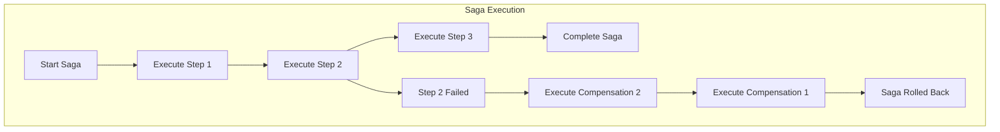

# Distributed Saga Framework

A distributed saga pattern implementation built on top of the Distributed Task Framework (DTF) for managing long-running transactions and maintaining data consistency across microservices.

<!-- TOC -->
* [Distributed Saga Framework](#distributed-saga-framework)
  * [Introduction](#introduction)
    * [Architecture](#architecture)
    * [Goals](#goals)
    * [Features](#features)
  * [Install](#install)
  * [Quick start](#quick-start)
    * [Let's create a distributed saga for order processing](#lets-create-a-distributed-saga-for-order-processing)
    * [What happened](#what-happened)
  * [Concepts](#concepts)
    * [Saga Method](#saga-method)
    * [Saga Revert Method](#saga-revert-method)
    * [Saga Flow](#saga-flow)
    * [Saga Flow Builder](#saga-flow-builder)
    * [Affinity](#affinity)
    * [Versioning](#versioning)
    * [Error Handling](#error-handling)
    * [Timeout Management](#timeout-management)
    * [Synchronous vs Asynchronous Execution](#synchronous-vs-asynchronous-execution)
  * [Advanced Usage](#advanced-usage)
    * [Complex Saga Flows](#complex-saga-flows)
    * [Conditional Logic](#conditional-logic)
    * [Nested Sagas](#nested-sagas)
    * [Handling Compensation Failures](#handling-compensation-failures)
  * [Configuration](#configuration)
    * [Spring Boot Properties](#spring-boot-properties)
    * [Saga Settings](#saga-settings)
  * [Best Practices](#best-practices)
  * [Monitoring and Troubleshooting](#monitoring-and-troubleshooting)
  * [License](#license)
<!-- TOC -->

## Introduction

### Architecture

The Distributed Saga Framework implements the saga pattern for managing distributed transactions across microservices. Each saga consists of a series of operations where each operation has a corresponding compensation action that rolls back the change if the saga fails.



The framework builds on top of DTF, leveraging:
- DTF tasks for saga step execution
- DTF's persistence layer for saga state
- DTF's retry mechanisms
- DTF's workflow capabilities

### Goals

- Provide a reliable way to manage distributed transactions across microservices
- Ensure data consistency through compensating transactions
- Support long-running business processes
- Integrate seamlessly with the Distributed Task Framework
- Minimize infrastructure dependencies

### Features

- **Compensating Transactions**: Automatic rollback on failure with custom compensation logic
- **Asynchronous Execution**: Non-blocking saga execution with result tracking
- **Versioning Support**: Safe rolling updates with versioned saga methods
- **Affinity Groups**: Ensure related sagas execute on the same instance
- **Flexible Error Handling**: Configure retry behavior and exception handling
- **Timeout Management**: Configurable timeouts for individual steps and entire sagas
- **Spring Boot Integration**: Easy setup with auto-configuration
- **Persistence**: Full saga state persistence in PostgreSQL

## Install

Add the saga module to your project along with DTF:

```groovy
implementation 'io.github.cherkovskiyandrey:distributed-task-spring-boot-starter'
```

Ensure you have the DTF database schema installed as described in the main DTF documentation.

## Quick start

### Let's create a distributed saga for order processing

First, define the models:

```java
public record OrderRequest(String orderId, String customerId, List<OrderItem> items) {}

public record OrderItem(String productId, int quantity, BigDecimal price) {}

public record OrderRevertableDto(@Nullable Order prevValue, Order newValue) {}
```

Create a service with saga methods:

```java
@Service
public class OrderService {

    @SagaMethod(name = "createOrder", version = 1)
    public OrderRevertableDto createOrder(OrderRequest request) {
        // Create order logic
        Order order = orderRepository.save(new Order(request));

        // Store previous state for potential rollback
        Order previousOrder = findPreviousOrder(request.getOrderId());

        return OrderRevertableDto.builder()
            .prevValue(previousOrder)
            .newValue(order)
            .build();
    }

    @SagaRevertMethod(name = "revertCreateOrder", version = 1)
    public void revertCreateOrder(OrderRequest input,
                                @Nullable OrderRevertableDto output,
                                @Nullable SagaExecutionException exception) {
        if (output != null && output.getNewValue() != null) {
            // Delete the created order
            orderRepository.delete(output.getNewValue());

            // Restore previous state if existed
            if (output.getPrevValue() != null) {
                orderRepository.save(output.getPrevValue());
            }
        }
    }

    @SagaMethod(name = "processPayment",
                version = 1,
                noRetryFor = {InsufficientFundsException.class})
    public PaymentResult processPayment(OrderRequest request) {
        // Process payment logic
        return paymentGateway.charge(request.getTotalAmount());
    }

    @SagaRevertMethod(name = "refundPayment", version = 1)
    public void refundPayment(OrderRequest input,
                            @Nullable PaymentResult output,
                            @Nullable SagaExecutionException exception) {
        if (output != null) {
            paymentGateway.refund(output.getTransactionId());
        }
    }
}
```

Create a controller to execute the saga:

```java
@RestController
@RequestMapping("/orders")
public class OrderController {

    @Autowired
    private DistributionSagaService sagaService;

    @Autowired
    private OrderService orderService;

    /**
     * Create order synchronously.
     * 
     * @param request
     * @return
     */
    @PostMapping
    public OrderResult createOrder(@RequestBody OrderRequest request) {
        return createOrderSaga(request)
            .get() // wait for result
            .orElseThrow(() -> new RuntimeException("Saga failed"));
    }

    /**
     * Create order asynchronously.
     * 
     * @param request
     * @return
     */
    @PostMapping("/async")
    public UUID createOrderAsync(@RequestBody OrderRequest request) {
        return createOrderSaga(request).trackId();
    }

    private SagaFlow<OrderResult> createOrderSaga(OrderRequest request) {
        // Build and execute the saga
        return sagaService
            .createWithAffinity("order-processing", "order", request.getOrderId())
            .registerToRun(
                orderService::createOrder,
                orderService::revertCreateOrder,
                request
            )
            .thenRun(
                orderService::processPayment,
                orderService::refundPayment
            )
            .start();
    }

    /**
     * Get saga result if ready, not wait (polling with result).
     * 
     * @param sagaId
     * @return
     */
    @GetMapping("/{sagaId}")
    public ResponseEntity<OrderResult> getOrderResult(@PathVariable UUID sagaId) {
        return sagaService.getFlow(sagaId, OrderResult.class)
            .filter(SagaFlow::isCompleted)
            .map(sagaFlow -> ResponseEntity.ok(sagaFlow.get()))
            .orElse(ResponseEntity.status(HttpStatus.PROCESSING));
    }
}
```

### What happened

1. **Saga Creation**: The saga starts with `createWithAffinity()`, ensuring all steps execute sequentially for the same order ID.

2. **Step Execution**:
   - First step: `createOrder` executes, creating the order
   - Second step: `processPayment` executes, charging the payment

3. **Success Path**: If all steps succeed, the saga completes and returns the result.

4. **Failure Path**: If any step fails:
   - Framework stops executing forward steps
   - Executes compensating methods in reverse order
   - If `processPayment` fails, `revertCreateOrder` is called to delete the order

5. **Persistence**: All saga state is stored in the database for recovery and monitoring.

## Concepts

### Saga Method

Saga methods are the forward-executing operations in a saga. They are marked with `@SagaMethod`:

```java
@SagaMethod(
    name = "methodName",           // Required: Unique name for routing
    version = 2,                   // Optional: Default 0, for versioning
    noRetryFor = {                 // Optional: Exceptions to skip retry
        OptimisticLockingFailureException.class,
        DuplicateKeyException.class
    }
)
public OutputType methodName(InputType input) {
    // Business logic
    return output;
}
```

Key points:
- **Name**: Must be unique across the cluster, maps to DTF task
- **Version**: Allows rolling updates with multiple versions
- **noRetryFor**: Exceptions where retry should be skipped

### Saga Revert Method

Revert methods provide compensation logic for rolling back changes:

```java
@SagaRevertMethod(
    name = "revertMethodName",     // Required: Unique name
    version = 2                    // Optional: Default 0
)
public void revertMethodName(
    InputType originalInput,       // The original input to the saga method
    @Nullable OutputType output,   // The output from the saga method
    @Nullable SagaExecutionException exception  // The exception that caused rollback
) {
    // Compensation logic
}
```

Important considerations:
- **Idempotent**: Should be safe to execute multiple times
- **Best Effort**: Even if compensation fails, the saga continues
- **Context**: Receives all necessary information for proper rollback

### Saga Flow

A saga flow represents an executing saga instance. You can interact with it in several ways:

```java
// Get existing saga
SagaFlow<ResultType> flow = sagaService.getFlow(sagaId, ResultType.class);

// Wait for completion and get result
Optional<ResultType> result = flow.get();

// Wait until saga is completed
flow.waitCompletion();

// Check compiling
boolean isCompleted = flow.isCompleted();

// Check canceling
boolean isCanceled = flow.isCanceled();

// Get trackId
UUID trackId = flow.trackId();

// Cancel the saga gracefully
flow.cancel(true);  // Completes current step then compensates

// Cancel the saga immediately
flow.cancel(false);  // Immediate cancellation
```

### Saga Flow Builder

The builder pattern allows constructing complex saga flows:

```java
SagaFlow<ResultType> flow = sagaService
    .create("sagaName")
    // Step with compensation
    .registerToRun(operation, revertOperation, input)
    // Another step with compensation
    .thenRun(nextOperation, nextRevert, nextInput)
    // Final step without compensation
    .thenRun(finalOperation)
    // Start execution
    .start();
```

Builder methods:
- `registerToRun()`: First step with compensation
- `thenRun()`: Chain additional steps
- `thenRunWithoutRevert()`: Step without compensation
- `thenConsume()`: Step that consumes input without return

### Affinity

Affinity provides serializable execution of related sagas:

```java
// Create saga with affinity
SagaFlowEntryPoint entryPoint = sagaService.createWithAffinity(
    "sagaName",
    "affinityGroup",     // Groups related sagas
    "affinityValue"      // Specific value for serialization
);
```

Use cases:
- Processing orders for the same customer
- Resource locking scenarios
- Sequential processing requirements

### Versioning

Versioning enables rolling updates without breaking in-flight sagas:

```java
@SagaMethod(name = "processPayment", version = 1)
public PaymentResult processPaymentV1(OrderRequest request) { ... }

@SagaMethod(name = "processPayment", version = 2)
public PaymentResult processPaymentV2(OrderRequest request) { ... }
```

The framework routes to the appropriate version based on:
1. Version specified when building the saga
2. Default version if not specified
3. Compatibility rules for major version changes

### Error Handling

The framework provides comprehensive error handling:

```java
try {
    sagaService.create("mySaga")
        .registerToRun(operation, revert, input)
        .start();
} catch (SagaMethodNotFoundException e) {
    // Saga method not registered
} catch (SagaExecutionException e) {
    // Execution failed
    if (e.getCause() instanceof BusinessException) {
        // Handle business exception
    }
} catch (SagaCancellationException e) {
    // Saga was cancelled
}
```

### Timeout Management

Configure timeouts at different levels:

```java
// Saga-level timeout
SagaSettings settings = SagaSettings.builder()
    .expirationTimeout(Duration.ofHours(1)
    .availableAfterCompletionTimeout(Duration.ofMinutes(1))    
    .build();

// Step-level timeout via configuration file
distributed-task:
 saga:
  saga-properties-group:
   saga-properties-group:
    TEST_SAGA_NAME:
     available-after-completion-timeout: PT1M
     expiration-timeout: PT10M
```

### Synchronous vs Asynchronous Execution

Choose execution mode based on requirements:

```java
// Asynchronous - returns immediately
SagaFlow<ResultType> flow = sagaService.create("saga")
    .registerToRun(operation, revert, input)
    .start();

// Get result later
ResultType result = flow.get().orElseThrow();

// Synchronous - waits for completion
ResultType result = sagaService.create("saga")
    .registerToRun(operation, revert, input)
    .start()
    .get()
    .orElseThrow();
```

## Advanced Usage

### Complex Saga Flows

Build complex transactional workflows:

```java
public UUID processComplexOrder(OrderRequest request) {
    return sagaService
        .createWithAffinity("complex-order", "order", request.getOrderId())
        // Reserve inventory
        .registerToRun(
            inventoryService::reserveItems,
            inventoryService::releaseItems,
            request.getItems()
        )
        // Create order
        .thenRun(
            orderService::createOrder,
            orderService::cancelOrder
        )
        // Process payment
        .thenRun(
            paymentService::chargePayment,
            paymentService::refundPayment
        )
        // Update loyalty points (no compensation needed)
        .thenRun(loyaltyService::addPoints)
        // Send notifications (the best effort, no compensation)
        .thenRun(notificationService::sendOrderConfirmation)
        .start()
        .trackId();
}
```

### Conditional Logic

Implement conditional saga steps:

```java
SagaFlowBuilder builder = sagaService.create("conditionalSaga")
    .registerToRun(step1, revertStep1, input1);

if (shouldExecuteStep2) {
    builder.thenRun(step2, revertStep2, input2);
}

if (premiumCustomer) {
    builder
        .thenRun(upgradeService::applyUpgrade)
        .thenRun(bonusService::addBonus);
}

builder.thenRun(finalStep).start();
```

### Nested Sagas

Create nested saga structures:

coming soon.

### Handling Compensation Failures

Configure behavior when compensation fails:

```java
SagaSettings settings = SagaSettings.builder()
    .stopOnFailedAnyRevert(true)  // Stop on first compensation failure
    .build();

// Or handle compensation failures in revert methods
@SagaRevertMethod(name = "revertOperation")
public void revertOperation(Input input, Output output, SagaExecutionException e) {
    try {
        // Compensation logic
    } catch (Exception compensationException) {
        // Log but don't rethrow to continue compensation chain if needed
        log.error("Compensation failed for operation", compensationException);
    }
}
```

## Configuration

### Spring Boot Properties

```yaml
distributed-task:
  enabled: true
  saga:
    enabled: true
    common:
      cache-expiration: PT30S
      deprecated-saga-scan-fixed-delay: PT10S
      expired-saga-batch-size-to-remove: 1000
    saga-stat-properties:
      top-n-sagas: 5
      calc-initial-delay: PT1S
      calc-fixed-delay: PT10S
    # Whole saga configuration by name
    saga-properties-group:
      default-saga-properties:
        available-after-completion-timeout: PT1M
        expiration-timeout: PT10M
      saga-properties-group:
        # Saga name
        TEST_SAGA_NAME:
          expiration-timeout: PT3M
    # Configuration for saga methods
    saga-method-properties-group:
      # Default configuration for all methods, override default configuration for tasks from task-properties-group#default-properties
      default-saga-method-properties:
        execution-guarantees: AT_LEAST_ONCE
        retry:
          fixed:
            delay: PT1S
            max-interval: PT5S
            max-number: 5
          retry-mode: FIXED
        max-parallel-in-cluster: 100
        timeout: PT10M
      # Customisation of configuration for dedicated saga method
      saga-method-properties:
        # Saga method name
        TEST_SAGA_METHOD_NAME:
          retry:
            fixed:
              delay: PT1S
              max-interval: PT5S
              max-number: 5
            retry-mode: FIXED
          max-parallel-in-cluster: 100
          timeout: PT10M
```

## Best Practices

1. **Idempotent Operations**: Design both forward and compensation methods to be idempotent
2. **Timeout Configuration**: Set appropriate timeouts to prevent hanging sagas
3. **Exception Handling**: Use `noRetryFor` for non-retryable exceptions
4. **Affinity Groups**: Use affinity for serialization
5. **Monitoring**: Track saga execution through micrometer metrics
6. **Testing**: Test both success and failure scenarios
7. **Logging**: Add detailed logging for debugging saga failures

## Monitoring and Troubleshooting

The framework provides overall micrometer metrics. Appropriate dashboards can be made for monitoring. 

Common issues:
- **Stuck Sagas**: Check for database connection issues or deadlocks
- **Failed Compensations**: Review compensation logic for non-idempotent operations
- **Timeout Errors**: Adjust timeout configurations
- **Version Mismatches**: Ensure all instances have the required saga versions

## License

Copyright 2025 Cherkovskiy Andrey

Licensed under the Apache License, Version 2.0 (the "License");
you may not use this file except in compliance with the License.
You may obtain a copy of the License at

    http://www.apache.org/licenses/LICENSE-2.0

Unless required by applicable law or agreed to in writing, software
distributed under the License is distributed on an "AS IS" BASIS,
WITHOUT WARRANTIES OR CONDITIONS OF ANY KIND, either express or implied.
See the License for the specific language governing permissions and
limitations under the License.